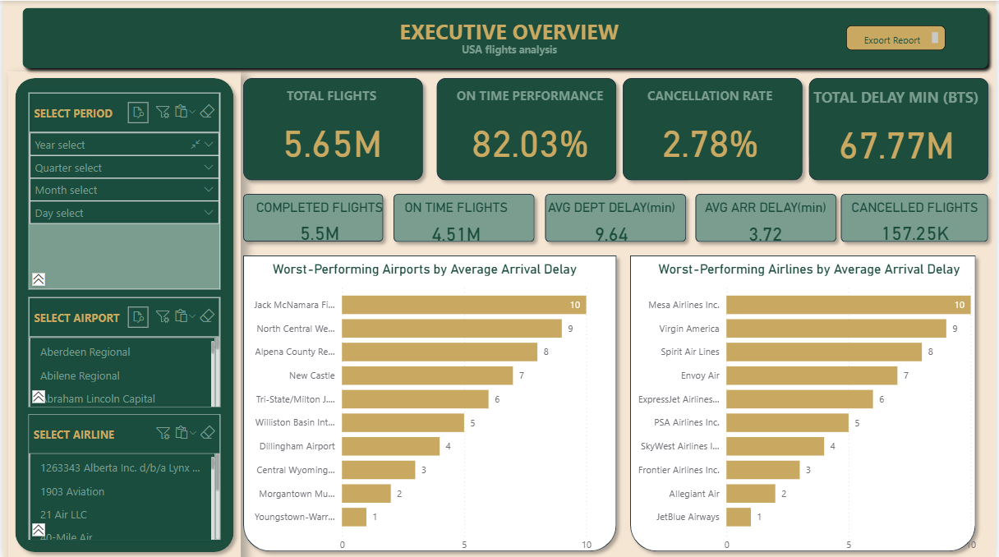
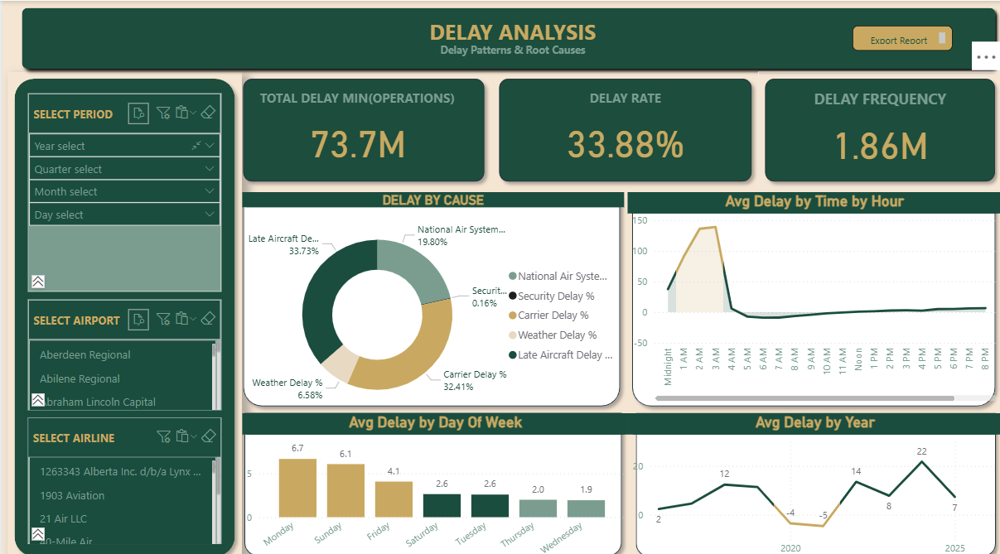
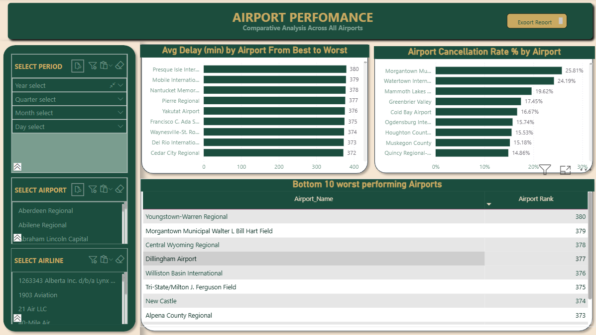
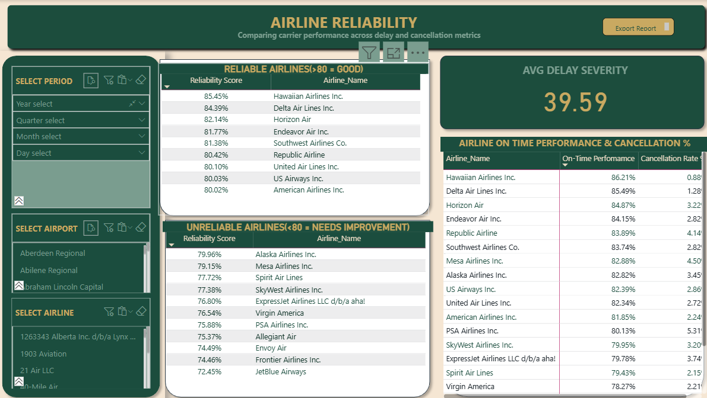
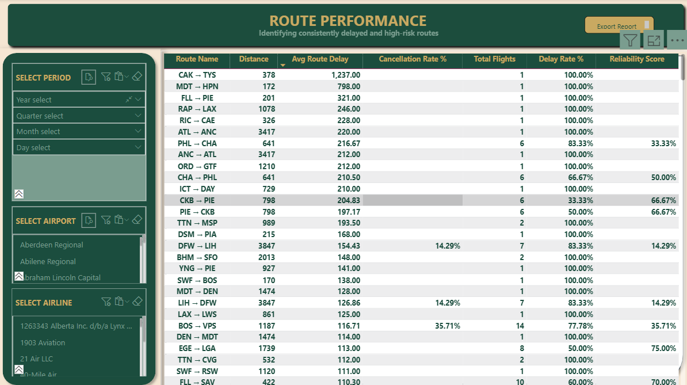
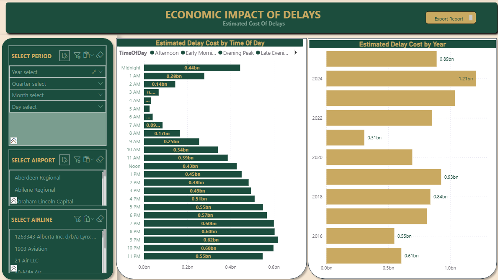
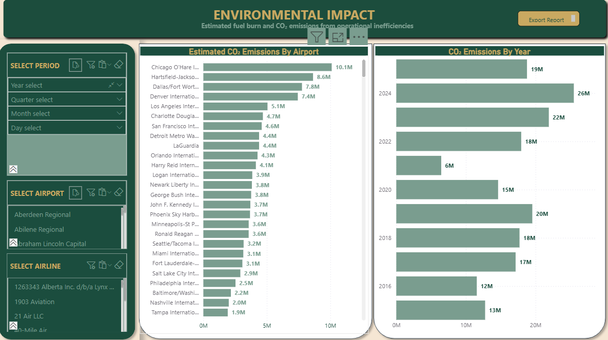
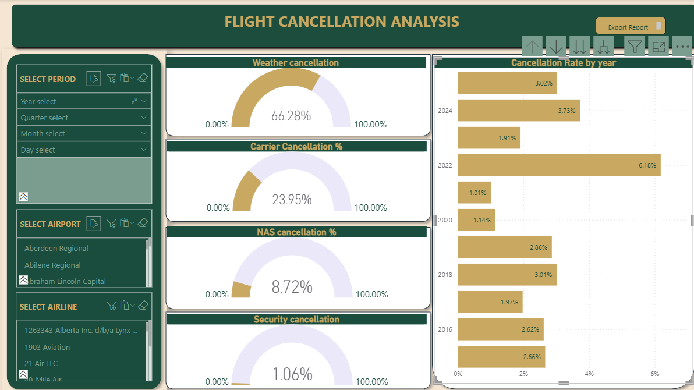

# ✈️ US Flights Operations Delay Analysis

## 1. About

This project delivers an end-to-end analytical review of US domestic flight operations, with a focus on **delays, cancellations, reliability, economic cost, and environmental impact**. Using publicly available US flight data, the analysis transforms millions of flight records into decision-ready insights for airlines, airports, regulators, and operations teams.

The goal is not just reporting but **diagnosing systemic operational inefficiencies** and highlighting where performance, reliability, cost control, and sustainability can be improved.

---

## 2. Introduction (Scope)

Modern aviation systems are highly interconnected—a delay at one airport or route can cascade across an entire network. This project explores **how, when, where, and why** these disruptions occur.

**Key themes explored:**
- Network-wide operational performance
- Root causes of delays (carrier, weather, late aircraft, NAS, security)
- Airline and airport reliability benchmarking
- Route-level risk identification
- Financial and environmental externalities of inefficiency

The analysis spans **10 years** and over **5.6 million flights**, enabling both trend analysis and structural performance comparisons.

---

## 3. Dashboard Summary

The Power BI report is organized into focused analytical dashboards:

###  Executive Overview

- Overall system health (on-time performance, cancellations, delays)
- High-level KPIs for leadership and stakeholders

###  Delay Patterns & Root Causes

- Delay contribution by cause
- Time-of-day, day-of-week, and yearly delay trends
- Identification of systemic operational bottlenecks

###  Airport Performance

- Worst-performing airports by average arrival delay
- Airports with the highest cancellation risk
- Ranking-based benchmarking across the national network

###  Airline Reliability

- Best vs worst-performing carriers
- Trade-off between punctuality and cancellation behavior

###  Route Performance

- High-risk and consistently delayed routes
- Routes with 100% delay rates
- Reliability and cancellation behavior at route level

###  Economic Impact

- Estimated cost of delays by year and time of day
- Identification of peak cost periods

###  Environmental Impact

- Estimated excess fuel burn from delays
- CO₂ emissions attributable to operational inefficiencies
- Airports contributing most to emissions

###  Flight Cancellation Analysis

- Cancellation trends and patterns
- Airports and airlines with highest cancellation rates
- Root causes of flight cancellations

---

## 4. Analytical Process

1. **Data Understanding & Cleaning**
   - Reviewed raw flight-level data
   - Handled nulls, cancellations, and delay edge cases

2. **Data Modeling**
   - Designed a star schema
   - Created dimension tables for airports, airlines, time, calendar, and routes
   - Managed active and inactive relationships for origin/destination logic

3. **Feature Engineering**
   - Calculated delay metrics, cancellation rates, reliability scores
   - Built route identifiers and performance flags

4. **DAX Development**
   - Advanced measures using `CALCULATE`, `RANKX`, `FILTER`, `USERELATIONSHIP`
   - Performance-aware aggregations

5. **Visualization & Storytelling**
   - Business-aligned dashboard design
   - Clear KPI framing and benchmarking logic

---

## 5. Key Insights

### Executive Performance
**Overall US aviation system performance:**
- 5.65M total flights with 82% on-time performance
- 2.78% cancellation rate
- Average departure delay: 9.64 minutes
- Average arrival delay: 3.72 minutes
- 157K flights cancelled, 5.5M completed successfully

### Operational Efficiency
**Root causes of delays:**
- Late aircraft delays: 33.73% (largest contributor)
- Carrier delays: 32.41%
- Weather: 19.80%
- National Air System issues: 6.58%
- Security delays: 0.16% (negligible)

**When delays typically occur:**
- Peak delay periods: Late night hours (Midnight-4 AM) show highest delays
- Worst day: Monday (6.7 min avg delay)
- Best day: Wednesday (1.9 min avg delay)
- 2020 & 2021 showed unusual patterns (-4 & -5 min avg respectively, likely COVID impact)
- Delay rate affects 33.88% of all flights

### Airline Reliability
**Top performers (>80 reliability score):**
- Hawaiian Airlines: 86.21% on-time, 0.88% cancellation
- Delta: 85.49% on-time, 1.28% cancellation
- Southwest: 83.74% on-time, 2.82% cancellation

**Bottom performers (<80 reliability):**
- JetBlue: 72.45% reliability score
- Frontier: 74.46%
- Envoy Air: 74.49%

**Airlines with worst arrival delays:**  
JetBlue, Allegiant, Frontier, SkyWest, and PSA Airlines

### Infrastructure & Network
**Airports that are operational bottlenecks:**

*Worst performers by delay:*
- Youngstown-Warren Regional (#380)
- Morgantown Municipal (#379)
- Central Wyoming Regional (#378)

*Highest cancellation rates:*
- Morgantown: 25.81%
- Watertown: 24.19%
- Mammoth Lakes: 19.62%

**Most problematic routes:**
- CAK → TYS: 1,237 min avg delay, 100% delay rate
- MDT → HPN: 798 min avg delay
- Several routes show 100% delay rates with significant time losses

### Financial Impact
**Economic cost of delays:**
- 2024 peak: $1.21 billion in delay costs
- Peak cost periods: 7-10 PM ($600M+ per hour slot)
- Lowest cost period: 5 AM ($25M+)

### Environmental/Sustainability
**Environmental impact of inefficiencies:**
- 2024 peak: 26M metric tons CO₂ from delays
- Chicago O'Hare leads emissions: 10.1M tons
- Atlanta Hartsfield: 8.6M tons
- Dallas/Fort Worth: 7.8M tons
- Denver International: 7.4M tons

### Business Conclusions

1. **Regional airport risk**: Smaller airports show disproportionately high cancellation rates (15-25%), indicating service reliability challenges

2. **Carrier reliability gap**: 14-point spread between best (Hawaiian 86%) and worst (JetBlue 72%) performers indicates operational excellence opportunities

3. **Time-of-day vulnerability**: Late evening operations accumulate delays throughout the day, suggesting schedule compression issues

4. **Environmental liability**: CO₂ emissions from delays represent significant sustainability risk and potential regulatory exposure

5. **Route-specific failures**: Routes with 100% delay rates indicate systematic problems requiring network redesign

---

## 6. Purpose & Target Audience

**Purpose:**
- Support operational decision-making
- Identify structural inefficiencies
- Enable performance benchmarking

**Target Audience:**
- Airline operations & network planning teams
- Airport authorities
- Aviation regulators
- Business & data analysts
- Sustainability and ESG stakeholders

---

## 7. What I Learned

- Designing scalable data models for large datasets
- Translating operational metrics into business KPIs
- Using DAX for ranking, benchmarking, and conditional logic
- Balancing analytical depth with executive-level clarity
- Applying analytics beyond finance into operations and sustainability

---

## 8. Next Phase

- Predictive analysis implementation

---

## 9. How to Use This Repository

📹 **Video Tutorial**

https://github.com/Anne-Wambaire-Mwangi/USA-flight-operations-analysis/assets/179276223/your-video-asset-id.mp4

*Alternative: [Click here to watch the tutorial](https://github.com/Anne-Wambaire-Mwangi/USA-flight-operations-analysis/blob/main/video/How%20To%20Navigate.mp4)*

📥 **Power BI File**
- [Download PBIX](https://drive.google.com/file/d/1bXrlKnyMT-KtkH0JB6_kqHgJHNrdK3z3/view?usp=drive_link)

**Instructions:**
- Open the `.pbix` file to explore interactive dashboards
- Review the exported PDF for a static executive summary

---

## 10. Notes

**Data Views:**
- **Operational view**: Includes all positive delay minutes (ArrDelay > 0) for root cause and customer experience analysis
- **Regulatory view**: Includes only flights with ArrDelay ≥ 15 for BTS/DOT compliance and industry benchmarking (Source: Bureau of Transportation Statistics, Airline Service Quality Performance 234)

**Data Source:**  
[Bureau of Transportation Statistics - On-Time Performance](https://www.transtats.bts.gov/DL_SelectFields.aspx?gnoyr_VQ=FGJ&QO_fu146_anzr=b0-gvzr)

---

**Author:** Anne Wambaire Mwangi  
**Focus:** Business Intelligence · Operations Analytics · Aviation Systems
